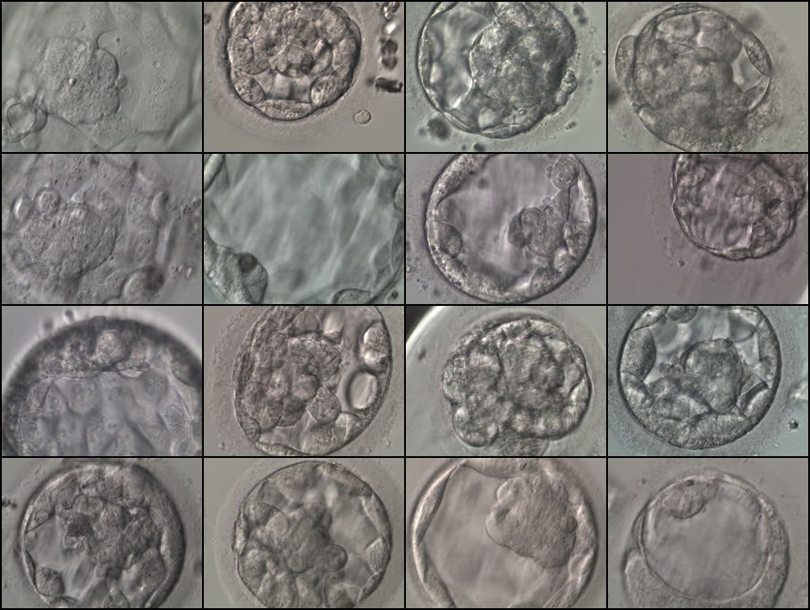
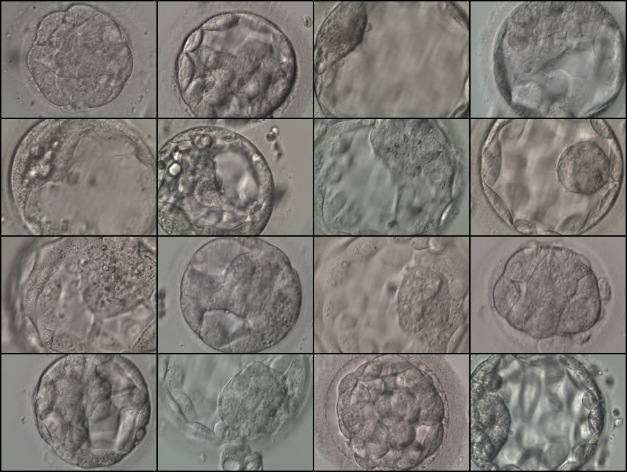
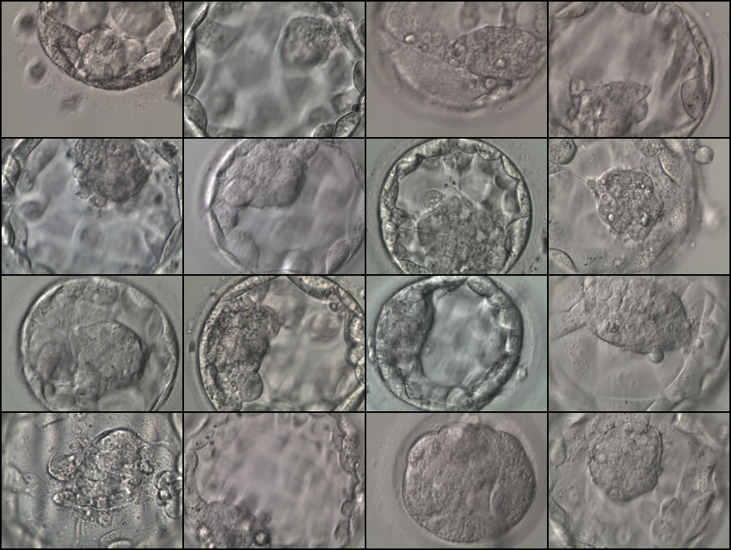
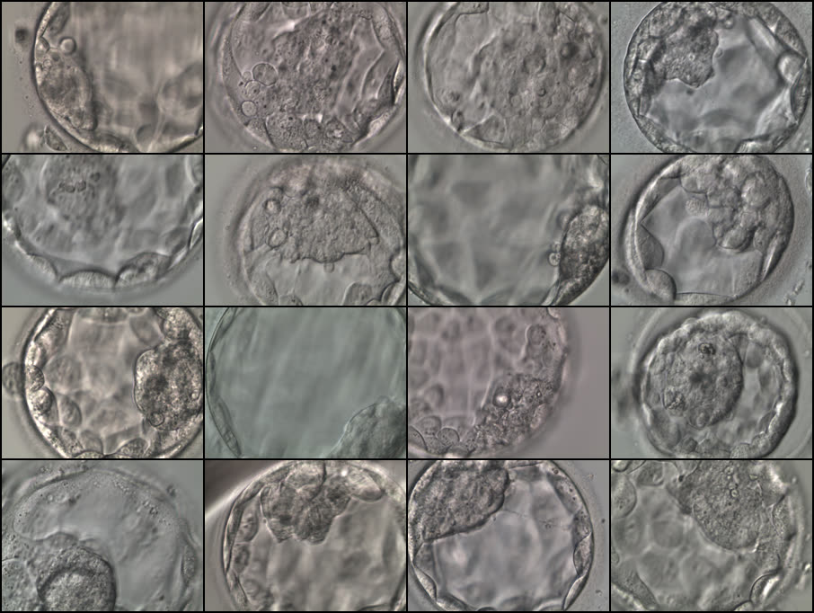
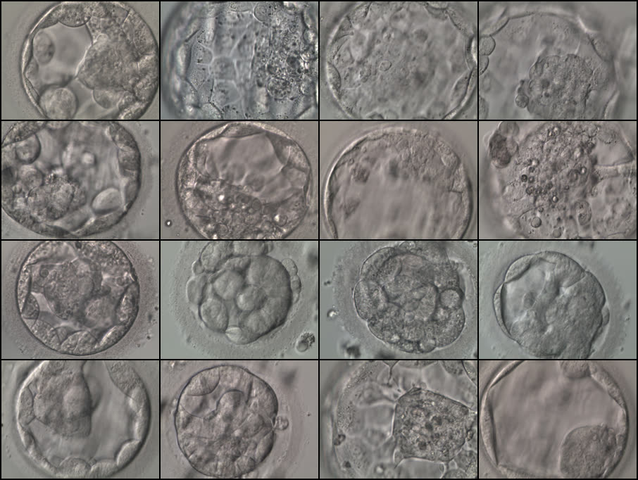
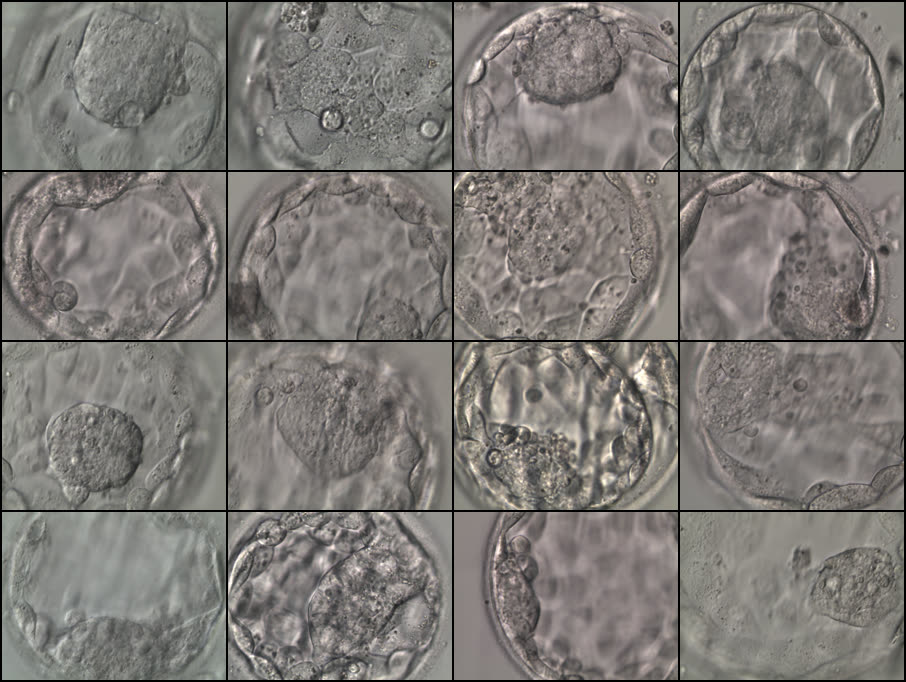
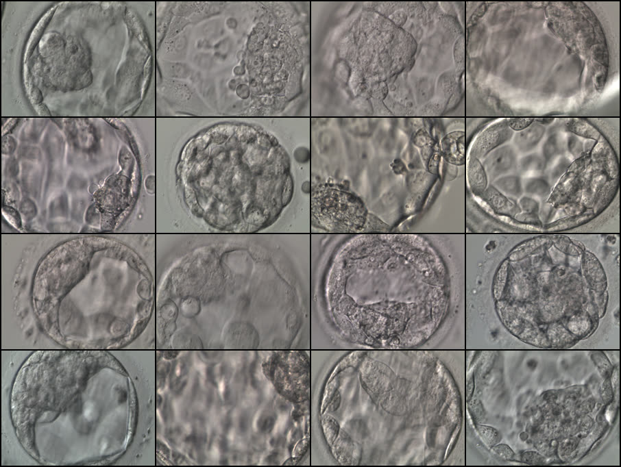
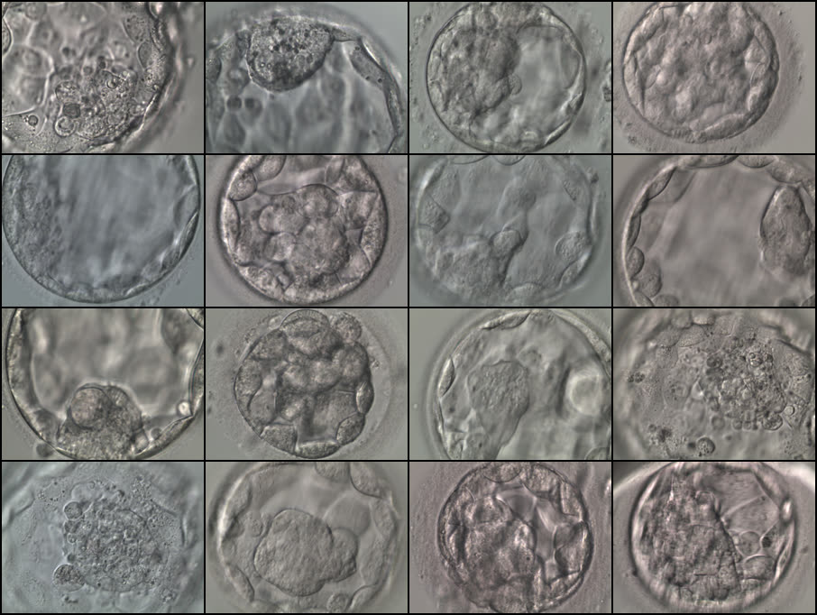

# Kromp Blastocyst Dataset Audit

Independent verification notes for the public **Kromp blastocyst dataset** used in IVF AI research.

## Scope
This repository verifies key claims from:

- Paper: *An annotated human blastocyst dataset to benchmark deep learning architectures for in vitro fertilization*  
  https://pmc.ncbi.nlm.nih.gov/articles/PMC10175281/
- Data DOI (figshare): https://doi.org/10.6084/m9.figshare.20123153.v3
- Split/code repository: https://github.com/software-competence-center-hagenberg/Blastocyst-Dataset

## Key Result (short)
- The core structure is confirmed: 2,344 images and a 2,044/300 silver-train/gold-test split.
- Clinical fields (`Age`, `AMH`, `Endo`, `SS`, `HA`, `LB`) are present.
- A small discrepancy exists in the downloadable clinical CSV row count vs. the paper text (details in report).

See full report:
- [`results/Kromp_Dataset_Verification_Report.md`](results/Kromp_Dataset_Verification_Report.md)


## Quantitative Snapshot (from cleaned master)

| Metric | Value |
|---|---:|
| Total images | 2,344 |
| Split (train_silver / test_gold / unassigned) | 2,043 / 300 / 1 |
| Clinical rows | 754 |
| Live birth labels (LB=1 / LB=0) | 234 / 520 |
| Resolution | 512×384 (all images) |


## Reproducibility Script
Run:

```bash
python scripts/verify_kromp_dataset.py --zip /path/to/Blastocyst_Dataset.zip
```

The script inspects:
- image count in `Images/*.png`
- row counts in Gardner split files
- clinical file columns and row count
- filename consistency between clinical rows and image files
## Data Preparation (local build manifests)

In addition to structural verification, this repo now includes a reproducible preparation script:

```bash
python scripts/prepare_kromp_dataset.py --zip /path/to/Blastocyst_Dataset.zip --out /path/to/output_dir
```

It creates manifest CSV files for:
- Gardner silver-train split
- Gardner gold-test split
- Clinical subset
- Unified master table (all images)

Example output summaries are in:
- `results/prepare_summary_example.json`
- `results/prepare_summary_example.md`

> Note: the original figshare ZIP is not committed. Public PNG images are included under `data/images/`.

## Final Cleaning (clinical + split-quality audit)

A second-stage cleaning script is provided:

```bash
python scripts/final_clean_kromp.py --base /path/to/Kromp_Prepared_Data
```

It produces:
- `prepared/final/master_final_clean.csv`
- `prepared/final/clinical_final_clean.csv`
- `reports/final_cleaning_summary.json`
- `reports/final_cleaning_summary.md`

The script includes:
- AMH normalization for locale/date-like artifacts
- split-quality checks (duplicates/unassigned)
- multimodal-ready row flags


## Image Data Included in Repository

This repository now includes the public image set under:

- `data/images/` (2,344 PNG files)

The image source is the public figshare artifact associated with the Kromp dataset DOI:
- https://doi.org/10.6084/m9.figshare.20123153.v3

A richer image-level analysis is provided in:
- `results/rich_image_analysis/Rich_Image_Analysis_Report.md`
- `results/rich_image_analysis/figures/*.png`

## Visual Findings (Report-style)

Visual outputs are now documented in **report format** (figure + explanation + implication), not as a raw gallery.

- Full report: [`results/rich_image_analysis/Visual_Insights_Report.md`](results/rich_image_analysis/Visual_Insights_Report.md)

### Figure A — Split consistency (overview)

| Random | Train silver | Test gold |
|---|---|---|
|  |  |  |

**Interpretation (short):**
- Visual style appears broadly consistent across splits at a coarse level.
- Reliability checks are still required for subtle shift and confidence misalignment.

### Figure B — Outcome groups (LB=1 vs LB=0)

| LB=1 | LB=0 |
|---|---|
|  |  |

**Interpretation (short):**
- Both groups show high morphological heterogeneity.
- Visual separation alone is not enough; calibrated probabilistic modeling is required.

### Figure C — Morphology label panels (EXP / ICM / TE)

| EXP example | ICM example | TE example |
|---|---|---|
|  |  |  |

**Interpretation (short):**
- Label-frequency imbalance and rare bins are visible in the full report.
- This supports reliability-aware evaluation (stratified metrics, CI, selective prediction).

### Why this format matters
- It ties each panel to a concrete research implication.
- It prevents “image dump without meaning” and improves thesis-ready traceability.

