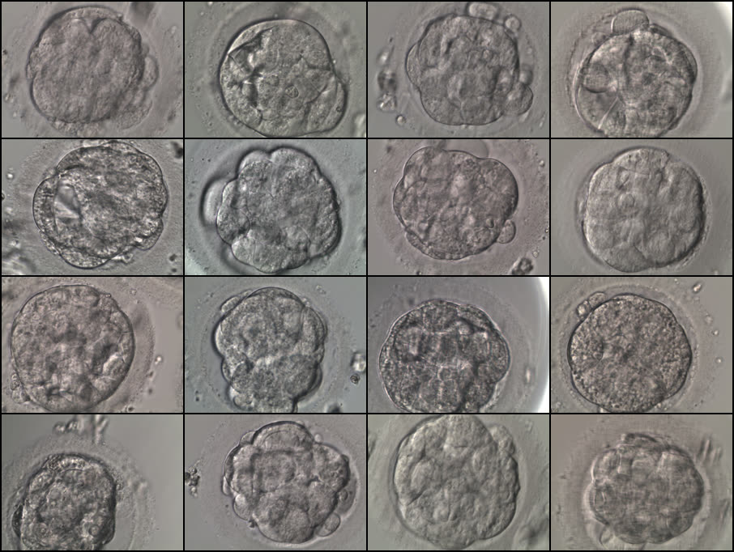
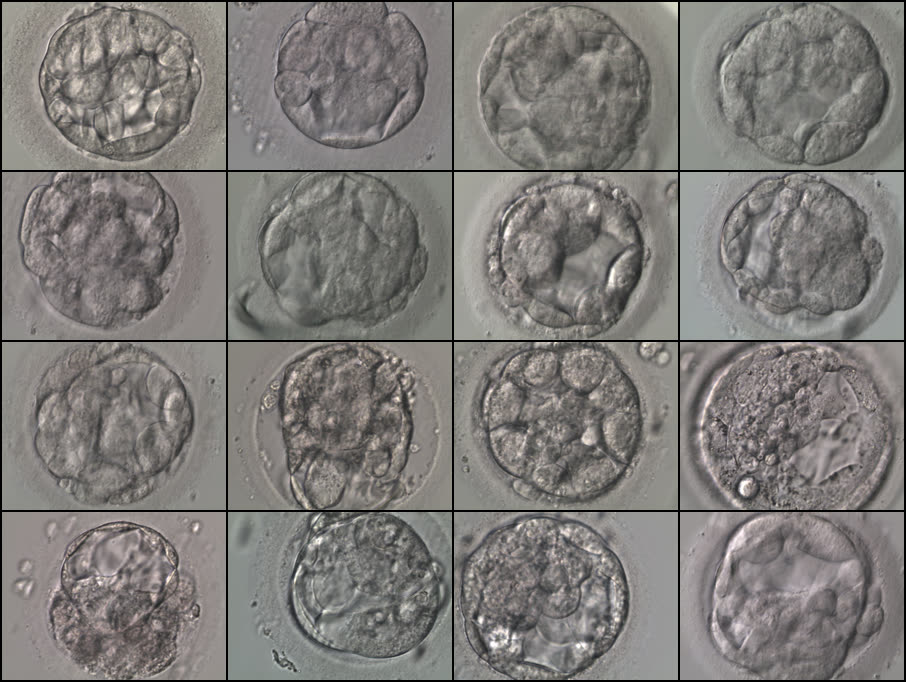
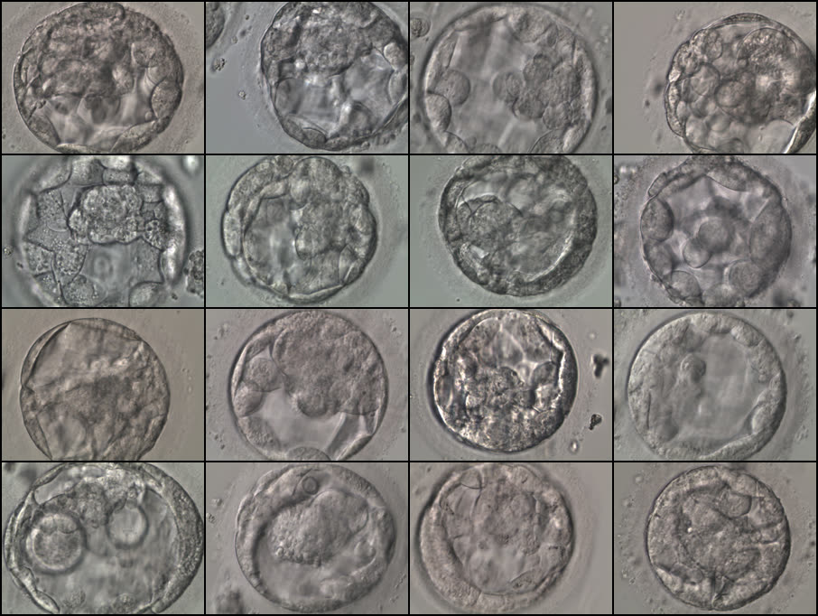
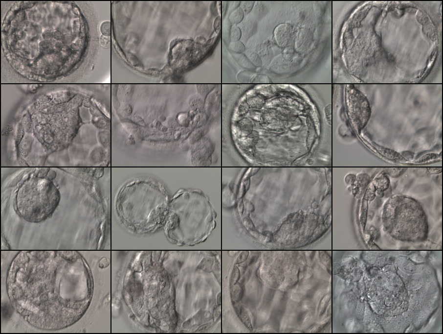
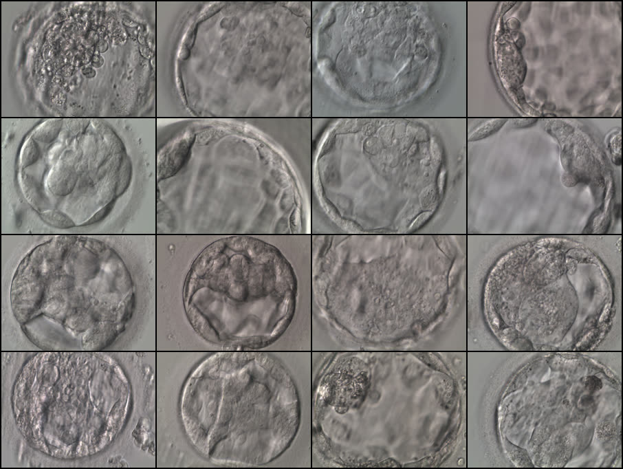
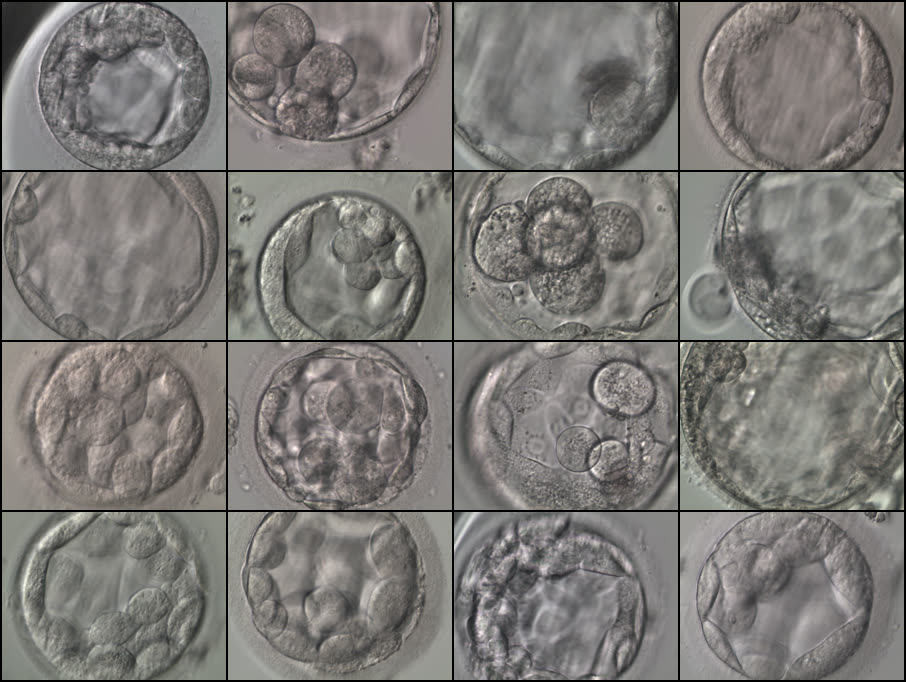
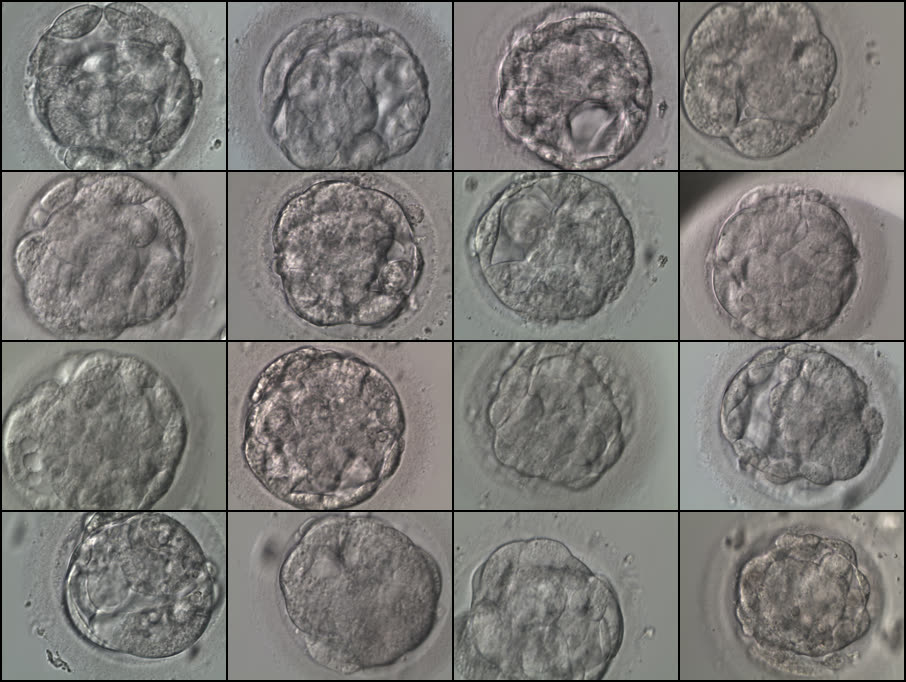
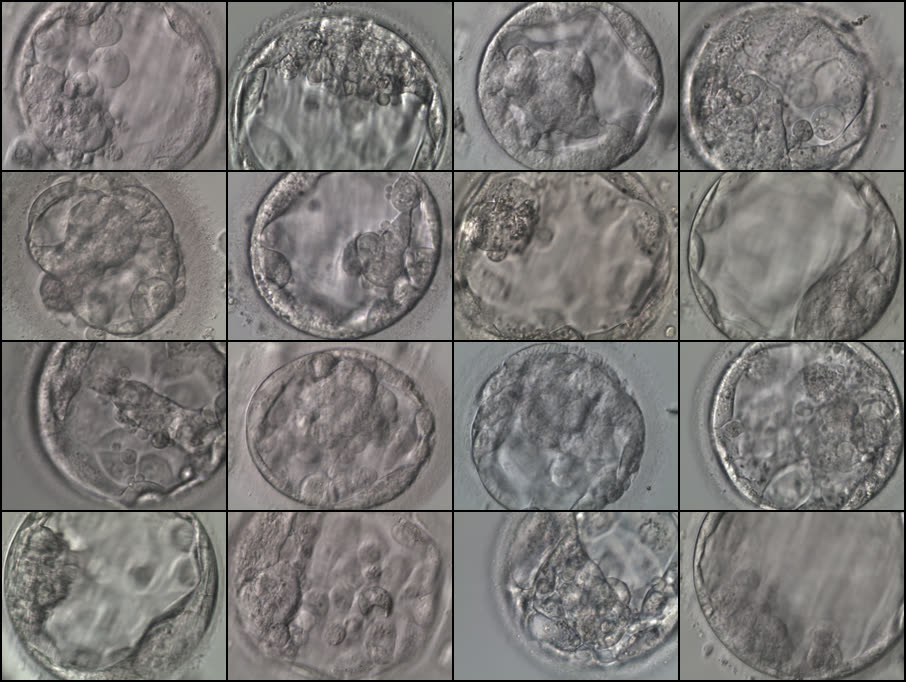
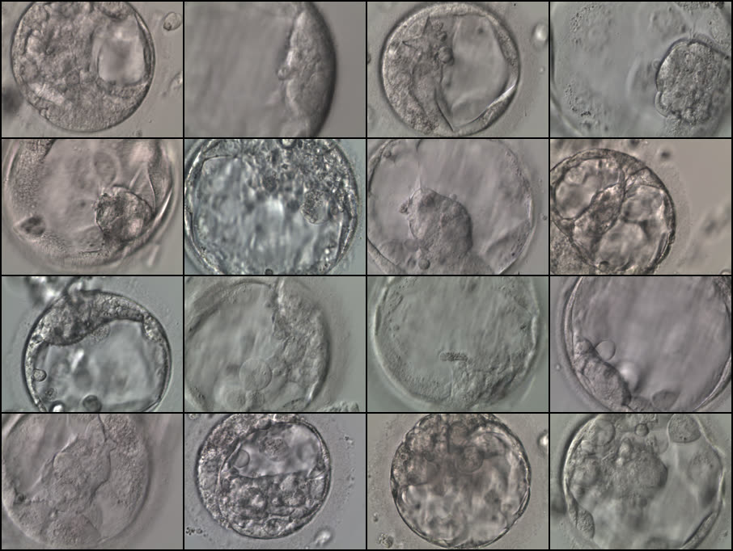
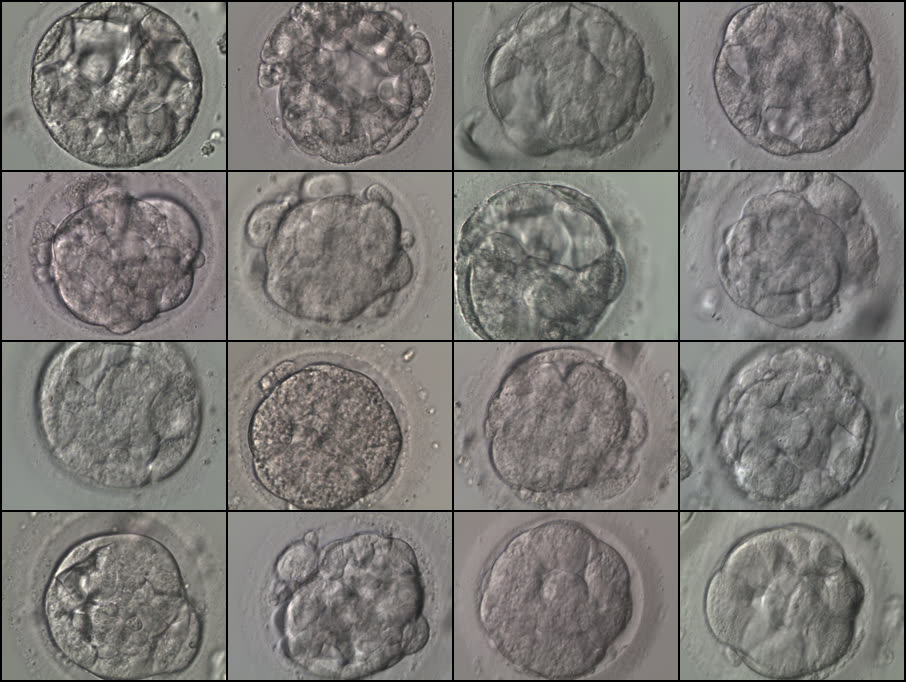

# Visual Insights Report (Kromp Blastocyst Dataset)

## 1) Purpose
This report explains the image panels in a **report-style narrative** (not just a gallery), linking each figure to practical modeling implications for reliability-aware IVF research.

## 2) Data snapshot used in this report

| Item | Value |
|---|---:|
| Total images | 2,344 |
| Split (train_silver / test_gold / unassigned) | 2,043 / 300 / 1 |
| Clinical subset rows | 754 |
| Live birth labels (LB=1 / LB=0) | 234 / 520 |
| Positive rate (LB=1) | 31.0% |
| Resolution | 512×384 (all images) |

---

## 3) Figure-by-figure interpretation

### Figure 1 — Overall view and split consistency

| Random sample | Train silver sample | Test gold sample |
|---|---|---|
|  |  |  |

**What this shows**
- Basic visual texture and framing are broadly consistent across train/test panels.
- There is no obvious catastrophic domain mismatch at a glance, but subtle scanner/protocol differences can still exist.

**Modeling implication**
- Keep explicit robustness checks (calibration under shift, OOD detection, selective prediction) even if visual drift is not obvious.

---

### Figure 2 — Outcome groups (LB=1 vs LB=0)

| LB=1 sample | LB=0 sample |
|---|---|
|  |  |

**What this shows**
- Visual diversity exists in both outcome groups.
- Group-level separation is not trivial by eye in small samples.

**Modeling implication**
- Avoid overclaiming morphology-only separability.
- Use uncertainty-aware predictions and calibration, not confidence by appearance.

---

### Figure 3 — Expansion (EXP) strata

| EXP=0 | EXP=1 | EXP=2 |
|---|---|---|
|  |  |  |

| EXP=3 | EXP=4 |
|---|---|
|  |  |

**Descriptive pattern (clinical subset)**
- EXP counts/rates:
  - EXP=0: n=43, LB rate=34.9%
  - EXP=1: n=56, LB rate=25.0%
  - EXP=2: n=111, LB rate=26.1%
  - EXP=3: n=380, LB rate=32.9%
  - EXP=4: n=63, LB rate=39.7%

**Modeling implication**
- EXP appears informative descriptively, but low-support bins need uncertainty-aware interpretation.

---

### Figure 4 — ICM strata

| ICM=0 | ICM=1 | ICM=2 | ICM=3 |
|---|---|---|---|
|  |  |  |  |

**Descriptive pattern (clinical subset)**
- ICM counts/rates:
  - ICM=0: n=474, LB rate=32.5%
  - ICM=1: n=79, LB rate=31.6%
  - ICM=2: n=1, LB rate=0.0% *(not interpretable)*
  - ICM=3: n=99, LB rate=29.3%

**Modeling implication**
- Severe sparsity in ICM=2 means class-wise metrics and confidence intervals are mandatory.

---

### Figure 5 — TE strata

| TE=0 | TE=1 | TE=2 | TE=3 |
|---|---|---|---|
|  |  |  |  |

**Descriptive pattern (clinical subset)**
- TE counts/rates:
  - TE=0: n=414, LB rate=33.6%
  - TE=1: n=128, LB rate=31.3%
  - TE=2: n=12, LB rate=0.0% *(very small n)*
  - TE=3: n=99, LB rate=29.3%

**Modeling implication**
- TE=2 rarity can destabilize both ranking and calibration if not handled explicitly.

---

### Figure 6 — High-density contact sheets (64 images)

- `figures/sample_all_64_grid.png`
- `figures/sample_lb1_64_grid.png`
- `figures/sample_lb0_64_grid.png`

**Purpose**
- Quick quality-control artifact for broad visual diversity and obvious artifact scanning.

---

## 4) Data-quality caveats that affect interpretation

1. Clinical data concentration: 653 train / 100 test / 1 unassigned.
2. Missingness in key clinical variables:
   - Endo missing: 156/754 (20.7%)
   - AMH missing after normalization: 165/754 (21.9%)
3. Split integrity flags:
   - duplicate source entry: `838_02.png`
   - unassigned image: `846_01.png`

These constraints should be explicitly reported in thesis Methods and Limitations.

---

## 5) Recommended next steps

1. Add patient-grouped bootstrap confidence intervals for AUROC/AUPRC/ECE.
2. Report risk-coverage curves for selective prediction.
3. Add per-class reliability tables for sparse morphology bins.
4. Perform missing-data sensitivity analysis (complete-case vs imputation/missing-indicator).

---

## 6) Usage note
This report is for research documentation and reproducibility. It is **not** a clinical decision-support output.
